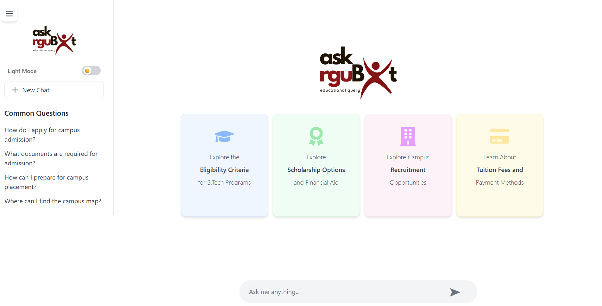
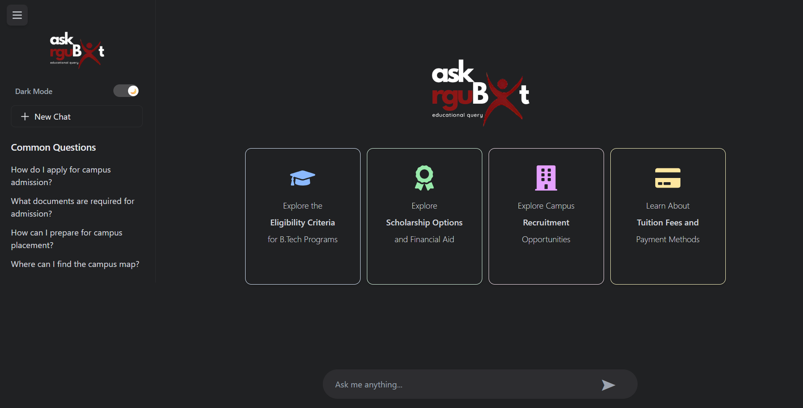
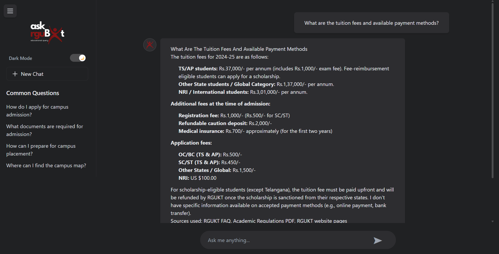

# RGUKT ChatBot 🎓

An AI-powered conversational assistant for **RGUKT (Rajiv Gandhi University of Knowledge Technologies), Basar campus** — built to answer student and visitor questions about admissions, eligibility, academics, campus facilities, scholarships, and more, using a Retrieval-Augmented Generation (RAG) pipeline grounded in official RGUKT documents and live website content.

### 🔗 [**Try the live chatbot →**](https://rgukt-bot-1.onrender.com)

> ⚠️ The backend runs on a free tier that sleeps when idle — the first message after inactivity may take 30–60 seconds to respond while it wakes up.

---

## 📖 Table of Contents

- [Overview](#overview)
- [Live Deployment](#live-deployment)
- [Architecture](#architecture)
- [Tech Stack](#tech-stack)
- [Project Structure](#project-structure)
- [How the RAG Pipeline Works](#how-the-rag-pipeline-works)
- [Local Development Setup](#local-development-setup)
- [Environment Variables](#environment-variables)
- [API Reference](#api-reference)
- [Deployment Guide](#deployment-guide)
- [Known Issues & Troubleshooting](#known-issues--troubleshooting)
- [Future Improvements](#future-improvements)
- [License](#license)

---

## Overview

This project is a full-stack chatbot application with two independently deployed parts:

- **Frontend** — A React (Vite) single-page application providing a ChatGPT-style conversational UI, complete with dark/light mode, quick-question cards, and a sidebar with common queries.
- **Backend** — A Python FastAPI service that answers questions by combining three sources of truth: a vector database of official RGUKT PDFs, live-scraped content from the RGUKT website, and a curated FAQ — then synthesizes an answer using a large language model (Gemini, with Groq as a fallback).

The goal is to give prospective and current students a fast, accurate, always-available way to get answers about RGUKT without digging through PDFs or navigating the university website.

---

## Screenshots

<table>
  <tr>
    <td align="center"><b>Home — Light Mode</b></td>
    <td align="center"><b>Home — Dark Mode</b></td>
  </tr>
  <tr>
    <td></td>
    <td></td>
  </tr>
  <tr>
    <td align="center" colspan="2"><b>Chat Conversation</b></td>
  </tr>
  <tr>
    <td colspan="2"></td>
  </tr>
</table>

---

## Live Deployment

| Component | Platform | URL |
|---|---|---|
| Frontend | Render (Static Site) | `https://rgukt-bot-1.onrender.com` |
| Backend  | Hugging Face Spaces (Docker) | `https://smitha-reddy09-rgukt-bot-backend.hf.space` |

The two are deployed **separately** and communicate over HTTPS — the frontend calls the backend's `/api/chat` endpoint for every message.

> **Why two different platforms?** The backend's dependencies (`sentence-transformers`, `chromadb`, `torch`, `transformers`) are memory-hungry — they require roughly 1–2 GB of RAM just to load the embedding model and vector index. Render's free tier (512 MB) couldn't handle this and crashed with out-of-memory errors. Hugging Face Spaces' free CPU tier offers 16 GB of RAM, which comfortably runs the full stack at no cost. The lightweight React frontend, by contrast, runs fine on Render's free static site hosting.

---

## Architecture

```
┌─────────────────┐         HTTPS POST          ┌──────────────────────┐
│                  │   /api/chat {text, ...}     │                      │
│  React Frontend  │ ───────────────────────────▶│   FastAPI Backend    │
│  (Render)        │                              │  (Hugging Face       │
│                  │ ◀─────────────────────────── │   Spaces, Docker)    │
└─────────────────┘      JSON {response: ...}     └──────────┬───────────┘
                                                              │
                          ┌───────────────────────────────────┼───────────────────────────────┐
                          │                                   │                                │
                          ▼                                   ▼                                ▼
              ┌───────────────────────┐         ┌─────────────────────────┐      ┌──────────────────────┐
              │  Chroma Vector Store   │         │   Live Web Scraper      │      │   Curated FAQ Data    │
              │  (rgukt2_db/, ~130MB)  │         │   (scrapes rgukt.ac.in  │      │   (hardcoded Q&A       │
              │  Pre-built from PDFs   │         │   pages per-request)    │      │   pairs)               │
              │  & scraped HTML using  │         └─────────────────────────┘      └──────────────────────┘
              │  sentence-transformers │
              │  embeddings             │                      │
              └───────────────────────┘                       │
                          │                                    │
                          └───────────────┬────────────────────┘
                                          ▼
                           ┌─────────────────────────────┐
                           │   Combined context fed to    │
                           │   LLM (Gemini 2.5 Flash,      │
                           │   fallback: Groq gpt-oss-20b) │
                           └─────────────────────────────┘
                                          │
                                          ▼
                              Final answer returned as
                                 styled HTML response
```

For every incoming question, the backend:
1. Searches the **Chroma vector store** for the most semantically similar chunks from official RGUKT PDFs (academic regulations, policies, handbooks, etc.)
2. **Scrapes relevant live pages** from the RGUKT website in real time
3. Checks a **curated FAQ** for any matching pre-written answers
4. Combines all three into a single prompt and sends it to **Gemini 2.5 Flash** (falling back to **Groq's `gpt-oss-20b`** model if Gemini is rate-limited or unavailable)
5. Formats the LLM's answer into styled HTML and returns it to the frontend

---

## Tech Stack

### Frontend
- **React 18** with **Vite** as the build tool (not Create React App)
- **Tailwind CSS** for styling
- **react-icons** for iconography
- Custom dark mode implemented via React Context + `localStorage`

### Backend
- **FastAPI** — async Python web framework, served via **Uvicorn**
- **LangChain** (`langchain`, `langchain-community`, `langchain-huggingface`, `langchain-groq`, `langchain-google-genai`) — orchestration layer for the RAG pipeline
- **ChromaDB** — local vector database for storing document embeddings
- **sentence-transformers** (`all-MiniLM-L6-v2` model) — generates embeddings for both indexed documents and incoming queries
- **Google Gemini 2.5 Flash** — primary LLM for answer generation
- **Groq** (`openai/gpt-oss-20b`) — fallback LLM used automatically when Gemini hits rate limits
- **BeautifulSoup4 + Requests** — live web scraping of RGUKT's official site
- **pypdf / pdfplumber / python-docx / python-pptx / openpyxl** — document parsing during the (offline) ingestion phase

### Infrastructure
- **Git LFS** — required for committing the ~130MB Chroma vector store, since it exceeds GitHub's 100MB per-file limit
- **Docker** — used for the Hugging Face Spaces deployment (custom Dockerfile, not the default Gradio/Streamlit SDK)
- **Render** — static site hosting for the frontend build output

---

## Project Structure

```
Rgukt-bot-main/
├── frontend/                          # React + Vite SPA
│   ├── src/
│   │   ├── App.jsx                    # Main chat UI, message handling, fetch calls to backend
│   │   ├── components/
│   │   │   ├── Cards/                 # Quick-question card components
│   │   │   ├── Chat/                  # Chat container
│   │   │   ├── Message/                # Individual message bubble rendering
│   │   │   └── Navbar/                 # Top navigation / sidebar
│   │   ├── hooks/useChat.js           # Custom hook for chat state (where applicable)
│   │   ├── pages/ThemeContext.jsx     # Dark/light mode context provider
│   │   ├── services/
│   │   │   ├── api.js                 # Centralized API base URL (reads VITE_API_BASE_URL)
│   │   │   └── chatService.js         # Chat-related API call helpers
│   │   └── utils/constants.js         # App-wide constants, also reads VITE_API_BASE_URL
│   ├── public/                        # Static assets served as-is (e.g. favicon)
│   ├── index.html                     # HTML entry point (favicon link lives here)
│   ├── vite.config.js
│   └── package.json
│
└── backend/                            # FastAPI service
    ├── app/
    │   ├── main.py                    # FastAPI app, /api/chat endpoint, RAG orchestration, LLM calls
    │   ├── services.py                # Vector store loading, retrieval helpers
    │   ├── models.py                  # Pydantic request/response schemas
    │   ├── schemas.py
    │   └── utils.py
    ├── rgukt2_db/                      # Pre-built Chroma vector store (tracked via Git LFS)
    │   ├── chroma.sqlite3              # ~124MB — the actual vector index
    │   └── <uuid>/                     # HNSW index binary files (data_level0.bin, etc.)
    ├── crawl_rgukt.py                  # One-time script: scrapes RGUKT site, builds vector store
    ├── ingest_pdfs.py                  # One-time script: ingests specific PDFs into the vector store
    ├── add_to_vectorstore.py           # One-time script: adds new content to an existing store
    ├── start_server.py                 # Local dev entry point (runs uvicorn on port 8000)
    ├── requirements.txt
    └── Dockerfile                      # Used for Hugging Face Spaces deployment (port 7860)
```

> **Note on the ingestion scripts** (`crawl_rgukt.py`, `ingest_pdfs.py`, `add_to_vectorstore.py`, etc.): these are **one-time, offline tools** used to *build* `rgukt2_db`. The live running app never executes them — it only *reads* the pre-built vector store. They're kept in the repo for reference / future re-indexing, but excluded from the deployed Docker image's relevant working set conceptually (though present in the repo).

---

## How the RAG Pipeline Works

1. **Offline indexing (done once, not at runtime):**
   - `crawl_rgukt.py` scrapes the RGUKT website and saves pages as HTML/text
   - `ingest_pdfs.py` parses official PDFs (academic regulations, policies, handbooks)
   - Both pipelines chunk the text, generate embeddings using `all-MiniLM-L6-v2`, and store everything in a local **Chroma** database at `./rgukt2_db`

2. **At request time (`app/main.py`):**
   ```python
   retriever = get_retriever()
   pdf_docs = retriever.invoke(resolved_text)          # semantic search against rgukt2_db
   pdf_context = "\n".join([d.page_content[:800] for d in pdf_docs[:5]])
   ```
   The top 5 most relevant chunks (each capped at 800 characters) are pulled from the vector store.

3. **In parallel**, the backend also:
   - Finds and scrapes relevant **live** RGUKT web pages (`find_relevant_urls`, `scrape_url`)
   - Checks for a matching **FAQ** entry (`get_faq_info`)

4. **All three sources are combined** into a single context string, truncated to a maximum character budget (to avoid exceeding the LLM's request size limits), and inserted into a prompt template instructing the model to answer **only** from the provided information — and to explicitly say so if the answer isn't present, rather than hallucinating.

5. **The LLM call** tries **Gemini 2.5 Flash** first; if it returns a rate-limit (`429`) or unavailable (`503`) error, the code automatically retries with **Groq's `gpt-oss-20b`** model instead — giving the app resilience against any single provider's outages or quotas.

6. The raw LLM text is wrapped in styled HTML (headers, paragraphs, source attribution) before being sent back to the frontend.

---

## Local Development Setup

### Prerequisites
- Python 3.10+ (a virtual environment is strongly recommended)
- Node.js + npm
- API keys for [Groq](https://console.groq.com/keys) and [Google AI Studio](https://aistudio.google.com/app/apikey) (Gemini)

### Backend

```bash
cd backend
python -m venv venv
.\venv\Scripts\Activate.ps1        # Windows PowerShell
# source venv/bin/activate          # macOS/Linux

pip install -r requirements.txt

# Create a .env file in the backend/ folder:
# GROQ_API_KEY=your_key_here
# GOOGLE_API_KEY=your_key_here

python start_server.py
```
The backend will run at `http://localhost:8000`, with interactive API docs at `http://localhost:8000/docs`.

### Frontend

```bash
cd frontend
npm install
npm run dev
```
The frontend will run at `http://localhost:5173` (Vite's default) and will call `http://localhost:8000` automatically in development, unless `VITE_API_BASE_URL` is set.

---

## Environment Variables

| Variable | Where it's used | Description |
|---|---|---|
| `GROQ_API_KEY` | Backend | API key for Groq's LLM (fallback model `openai/gpt-oss-20b`) |
| `GOOGLE_API_KEY` | Backend | API key for Google Gemini (primary model, `gemini-2.5-flash`) |
| `VITE_API_BASE_URL` | Frontend (build-time) | Base URL of the backend API. In production, set to the Hugging Face Space URL. Falls back to `http://localhost:8000` if unset. |

> **Security note:** Never commit `.env` files. API keys should always be set as environment variables / secrets directly on the hosting platform (Render's "Environment" tab, Hugging Face Spaces' "Variables and secrets" page) — never hardcoded or pasted into version control.

---

## API Reference

### `POST /api/chat`

Send a user message and receive a generated answer.

**Request body:**
```json
{
  "session_id": "1234567890",
  "text": "What are the eligibility criteria for B.Tech programs?",
  "chat_history": []
}
```

| Field | Type | Required | Description |
|---|---|---|---|
| `session_id` | string | Yes | Client-generated identifier to track conversation state |
| `text` | string | Yes | The user's question (note: the field is `text`, **not** `message`) |
| `chat_history` | array | No | Prior conversation turns, used for follow-up context resolution |

**Response body:**
```json
{
  "response": "<div style=\"...\">...formatted HTML answer...</div>"
}
```

The `response` field contains pre-styled HTML (inline styles) ready to be rendered directly via `dangerouslySetInnerHTML` on the frontend.

### `GET /`
Health check endpoint. Returns:
```json
{ "message": "RGUKT ChatBot API is running", "status": "healthy" }
```

### `GET /docs`
Auto-generated interactive Swagger UI (provided by FastAPI) for exploring all available endpoints.

---

## Deployment Guide

### Backend → Hugging Face Spaces

1. Create a new Space with the **Docker** SDK and **CPU basic (free)** hardware tier.
2. Push the `backend/` folder's contents to the Space's git repo (the Space's `README.md` needs YAML frontmatter with `sdk: docker`).
3. Because `rgukt2_db/chroma.sqlite3` is ~124MB (over GitHub/HF's 100MB single-file limit), it must be tracked via **Git LFS**:
   ```bash
   git lfs install
   git lfs track "rgukt2_db/*.sqlite3"
   git add .gitattributes
   ```
4. Add `GROQ_API_KEY` and `GOOGLE_API_KEY` as **secrets** in the Space's Settings → "Variables and secrets" page.
5. The included `Dockerfile` builds the image and starts Uvicorn on **port 7860** (Hugging Face Spaces' expected port for Docker SDK apps):
   ```dockerfile
   FROM python:3.10-slim
   WORKDIR /app
   COPY requirements.txt .
   RUN pip install --no-cache-dir -r requirements.txt
   COPY . .
   EXPOSE 7860
   CMD ["uvicorn", "app.main:app", "--host", "0.0.0.0", "--port", "7860"]
   ```
6. The Space's actual running app is available at a direct URL of the form:
   `https://<username>-<space-name>.hf.space` (lowercase) — distinct from the management page at `huggingface.co/spaces/<username>/<space-name>`.

### Frontend → Render (Static Site)

1. Connect the GitHub repo, set **Root Directory** to `frontend`.
2. **Build Command:** `npm install && npm run build`
3. **Publish Directory:** `dist` (Vite's default output folder)
4. Add an environment variable: `VITE_API_BASE_URL` = the backend's Hugging Face Space URL.
5. Since Vite **bakes environment variables in at build time**, any change to this variable requires a fresh build — use "Clear build cache & deploy" on Render if a change doesn't seem to take effect.

---

## Known Issues & Troubleshooting

A running log of real issues encountered while building and deploying this project, kept here so future debugging doesn't start from scratch:

| Issue | Cause | Fix |
|---|---|---|
| Render backend crashed with "Out of memory (used over 512Mi)" | `sentence-transformers` + `chromadb` + `torch` need more RAM than Render's free 512MB tier | Moved backend to Hugging Face Spaces (16GB free RAM) |
| `git push` rejected: "file exceeds GitHub's file size limit" | `chroma.sqlite3` is ~124MB, over the 100MB hard cap | Used `git lfs migrate import --include="*.sqlite3" --everything` to convert it (and its full history) to a Git LFS pointer |
| Frontend chat requests failed with `ERR_CONNECTION_REFUSED` pointing at `localhost:8000` | `VITE_API_BASE_URL` env var was added on Render *after* the last build — Vite only reads env vars at build time | Triggered a "Clear build cache & deploy" on Render |
| Quick-question **cards** failed while typed messages worked | `App.jsx` had **two** separate hardcoded `fetch("http://localhost:8000/api/chat")` calls — only one was updated to use the env variable | Found and fixed the second occurrence in the card-click handler |
| CSS failed to load with a MIME-type error | Turned out to be a transient browser caching issue, not a real server misconfiguration — verified by fetching the CSS URL directly | No fix needed; confirmed file was served correctly |
| Bot says "I don't have this information available" for a question it used to answer correctly before deployment | A hardcoded `max_context = 3000` character limit truncates the combined FAQ + PDF + scraped-website context before it reaches the LLM, potentially cutting off the relevant section | Reordered sources so PDF content is prioritized first, and increased the limit (e.g. to 6000) to give the model more room |
| Multiple confusing copies of `rgukt2_db` across the project | Several iterations of development left duplicate/stale vector store folders (some only 188KB vs the real 124MB one) scattered in `backend/`, `backend/app/`, and the project root | Identified the one actually referenced by `persist_directory="./rgukt2_db"` in `services.py`/`main.py` (relative to the backend's working directory) and deleted the rest |
| `venv/` and `node_modules/` accidentally staged for commit | No `.gitignore` existed initially | Added `.gitignore` rules for `venv/`, `node_modules/`, `__pycache__/`, `.env`, and build artifacts |

---

## Future Improvements

- [ ] Move the live web-scraping step to a caching layer (e.g. periodic background re-scrape + cache) rather than scraping on every single request, to reduce latency and avoid potential rate-limiting from the source website
- [ ] Add a proper `langchain-chroma` import to replace the deprecated `Chroma` import from `langchain_community` (currently raises a `LangChainDeprecationWarning` on every startup)
- [ ] Add a HF Hub access token (`HF_TOKEN`) as a secret to avoid "unauthenticated requests" rate-limit warnings when downloading the `all-MiniLM-L6-v2` embedding model on cold starts
- [ ] Persist conversation history server-side (currently passed back and forth from the client) for more robust multi-turn context resolution
- [ ] Add automated tests for the retrieval pipeline to catch context-truncation regressions like the one documented above
- [ ] Consider pinning a CPU-only build of `torch` in `requirements.txt` to avoid pulling in unnecessary CUDA/GPU libraries during installation, shrinking build time and image size

---

*Built and deployed as a student project — backend on Hugging Face Spaces, frontend on Render, powered by Gemini and Groq.*
